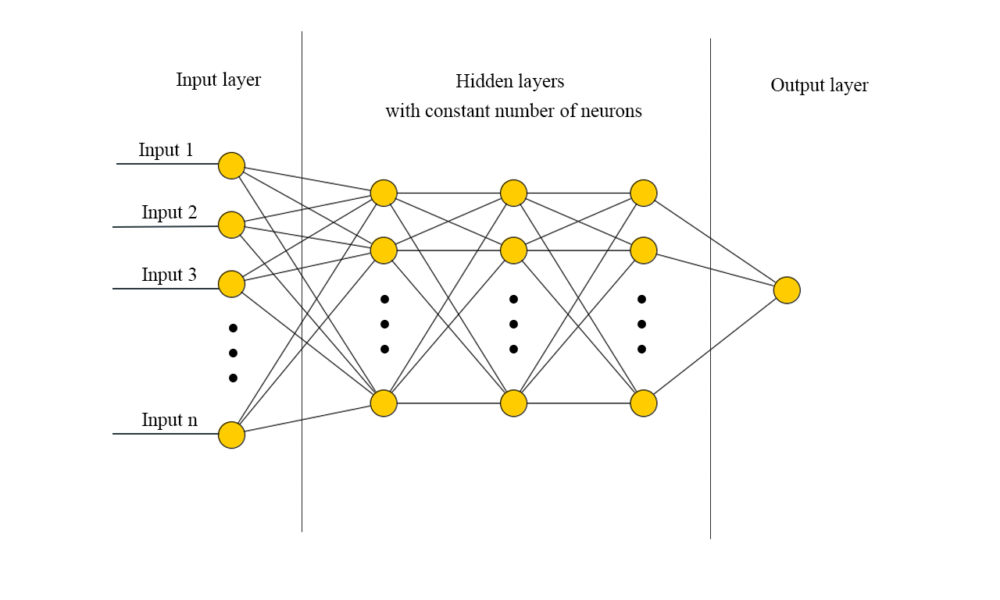
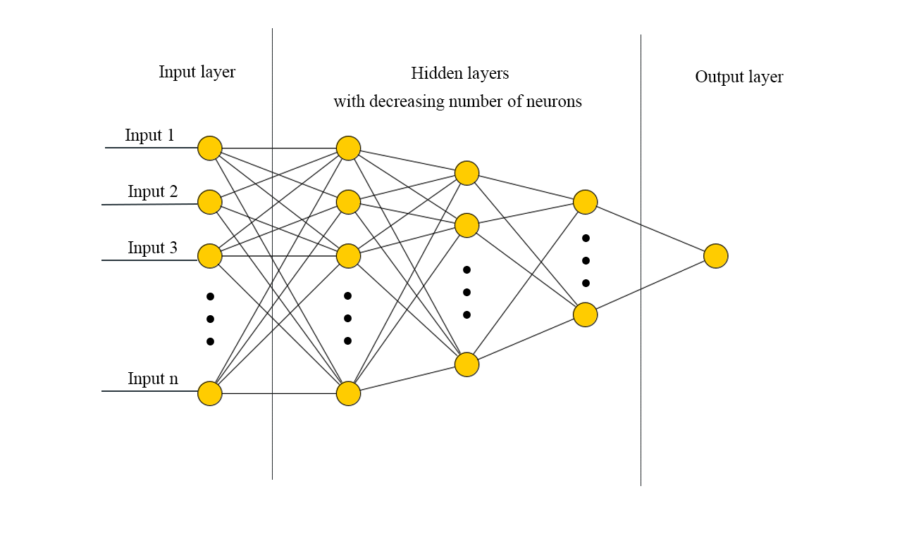

# AI & Machine Learning Project

### Dataset: Social Media Shares

### Members
- Chakir El Arrag 276931
- Iraj Nayebkhil 273671
- Eduardo Mosca

# Introduction:

In this project, we will help the social media department of a company analyse its communications' success. They want to develop a tool that predicts the number of shares on social media given the contents and the supposed publication time. Therefore they have collected a dataset with multiple features to help us design the best machine-learning solution.

# Methods 

We created an environment for our project and we exported it. In this same folder you can find a file called "environment.yml", this object will allow the user to create the environment on his computer and to install all the packages needed automatically on the environment.
You should follow these steps (after saving this folder on your computer):

- Open Anaconda Prompt
- Type `conda env create -f environment.yml` (this will create the environment from the .yml file)
- Type `conda activate ai_project` (to activate the environment)
- Type `jupyter notebook` this will open jupyter, then find main.ipynb and open it. You're good to go.

Moreover, we used the `dill` library on python in our jupyter notebook in order to save the outcomes we get by running our code. This explains the presence of the "notebook_ai.db" file. When you run the jupyter file, at the beginning it checks if "notebook_ai.db" exists, if it's the case then it loads all the variables that were saved in the previous session so that we don't need to run the CV (that takes hours) in order to run the cells after it.

Concerning the machine learning models used in our project, the only part that needs to be clarified is the one with artificial neural networks, since for the other models we only made use of built-in models in the sklearn library.
We built an ANN in which we can choose the number of hidden layers, the kernel initializer for the layers and their activation function. These are all hyperparameters that can influence the output. Also, we included an option that specifies whether the number of neurons per layer is constant or decreasing since one may out-perform the other depending on the problem. Also, the optimal number of hidden neurons should be around the mean of the input and output size.

#### Representation of an ANN with constant number of neurons in the hidden layers

#### Representation of an ANN with decreasing number of neurons in the hidden layers

We added L1 and dropout regularizations as well L1 as the first will help in the features selection by the model by affecting the weights and the second will make our model more robust. 

# Experimental Design

First off, we started by doing an exploratory data analysis in which we took a look at some initial informations about our dataset, evaluate the correlation and get some statistical info and the shape of our dataset.

Then, we removed outliers from our dataset. To do so, we start by identifying the categorical variables and check that there are no errors in their entries (should be either 0 or 1), the categorical variables weren't treated after that because they don't have outliers. By examining the distributions of our variables, we remove the outliers using the appropriate method. We either use trimming ie: we remove the outliers from the dataset, or we replace the values with the median of the corresponding variables. Moreover, we can transform some of our variables as well to correct their distributions.

After removing the outliers, we splitted the dataset into training, validation and test sets, and we scaled the independent variables using MinMaxScaler since we have a regression problem.

We tested three moddels in our project, Multivariable Linear Regression, Random Forest and Artificial Neural Networks (ANN). We started by testing the models with the default parameters on the validation set and then we did a 10-fold cross-validation for Random Forest and ANN in order to find the best hyperparameters for each model. In the end, we tested the models on the validation set. We used the mean absolute error (MAE) to evaluate our models. Since we knew the range of our dependent variable it was easier to interpret this metric and evaluate our models as MAE measures the average error made in predicting each output. We tried to use $R^2$ as well, the values were low but still positive, that's due to the social nature of our experiment as the independent variables are not explaining much in the variation of the dependent variable. In the end, we relied on MAE.

After getting the best model, we worked on feature selection. We used the correlation with the dependent variable, the important features for Random Forest in order to choose a set of the attributesand some feature selection methods from sklearn. The performance was pretty much the same in terms of errors, but we reduced the number of attributes used from 57 to 16, with the possibility of further selection of smaller sets of attributes. So now our model is faster and requires less computational resources while still performing as good as before.

# Results

After testing the three models on the validation set we got the following results:

After performing our best model on the test set we get the following results:
MAE = , MSE = , $R^2$ = 

After selecting the features we get:
MAE = , MSE = , $R^2$ = 

# Conclusions

To conclude, we can say that we managed to come up with a good model to predict the number of shares. Although, this model works only to predict posts with a number of shares between 0 and 2000. The social media department of the company should provide us with more data in order to cover a larger range and get a more robust machine-learning solution.
There are a couple of questions that are not fully answered by our work:
The first is about the relationship between the independent variables and the dependent variables. Are we sure that the dataset provided to us by the social media department has the right attributes to use in order to predict the number of shares? The low value of $R^2$ that we talked about before indicates that independent variables may not be enough to explain the variation of our target variable. So we might need a deeper study of the feature that might influence the outcome of our dependent variable.
The second question, that relates to the first question as well, is about our feature selection. Is there a way to improve also the performance of our models in terms of error using a set of the attributes from the dataset?